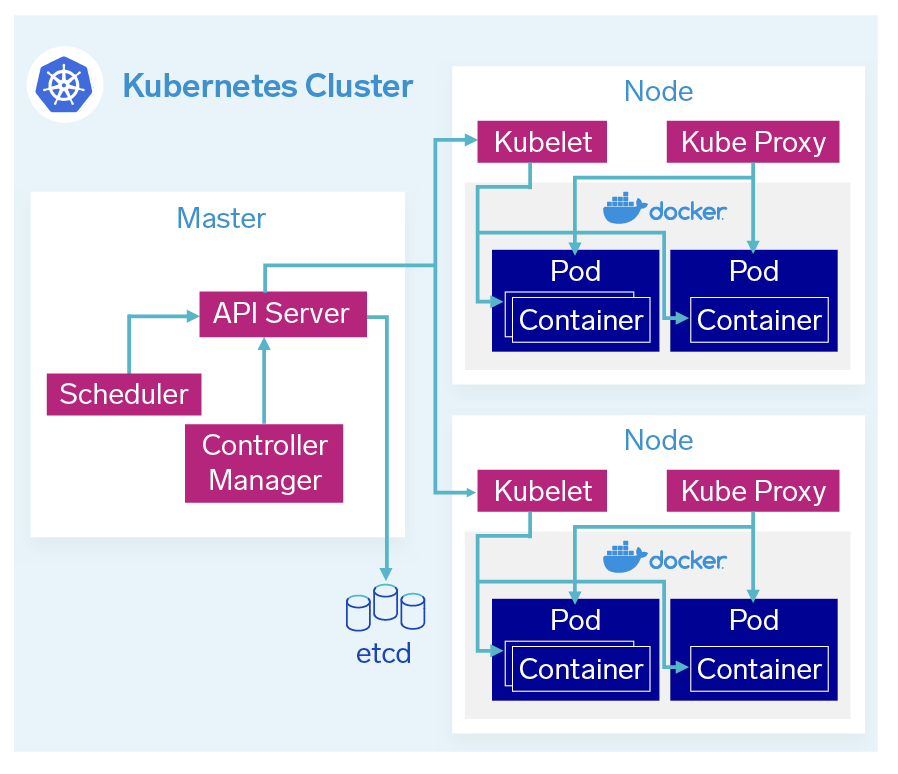

# Deploymnet of Containers

### What is Docker?
Docker is a __Linux-based open-source tool that allows developers to create, deploy and run applications in lightweight containers__. It gives you all the great perks of containerization technology and allows you to code, ship, and deploy your software faster than ever!

It is a stable and battle-tested technology that got released in 2013. Since then it has been adopted by a lot of big companies including Google, AWS, and Microsoft. It is backed by a huge community of developers, which means that you can easily find help if you ever get stuck.

Docker isn’t the only containerization tool on the market, but it is the most popular one. Some of the great alternatives include Podman, LXD, containerd, and Buildah.

### Benefits of using Docker
In addition to all the benefits of containerization technology, Docker comes with several other benefits. Let’s look at them.

*Lightweight*
With its lightweight and speedy nature, Docker offers a practical and budget-friendly substitute for virtual machines. Docker is appropriate for high-density environments and for small and medium deployments where you need to do more with fewer resources.

*Version Control*
Docker allows for the versioning of applications, making it easy to roll back to a previous version if necessary. This can help to reduce downtime and minimize the impact of issues related to updates or changes to an application.

*Improved Collaboration*
__Docker Hub__ is a __cloud-based repository for storing, sharing, and managing Docker images__ and there is no need to create a Docker image from scratch. It provides a central location for discovering and sharing popular Docker images, including those created by the Docker community and official images from software vendors. It is closely integrated with Docker CLI and Docker Desktop.

*Scalability*
Docker provides a scalable architecture that can be used to deploy applications to large-scale distributed systems, such as clusters or cloud platforms. Docker’s ability to handle large numbers of containers and orchestrate them through tools like Docker Swarm or Kubernetes allows for easy scaling up or down based on demand.#

## Deployment in Development Environment
### 1. Local mode

The easiest way to get Docker up and running on your local machine is by installing Docker Desktop. __Docker Desktop__ is an application that provides an easy-to-use GUI and tools required to build, test, and deploy containerized applications on your local machine. It allows you to manage containers, images, and volumes. It has a built-in Docker Engine, Docker CLI, and Docker Compose.

Additionally, it allows you to use Docker Extensions which can help you automate your workflows and tasks. Docker Desktop makes it easy for you to collaborate with other developers and has great built-in Docker Hub support.

Docker Desktop is available on Windows, Mac as well as Linux.

## Deployment in Production Environment
### 2. Kubernetes

Kubernetes is an open-source container management system developed by Google and made available to the public in June 2014. A container is a virtualized environment that consists of an application and all the configuration files, libraries, binaries and dependencies needed to execute that application. Kubernetes aims to make deploying and managing complex distributed systems easier for DevOps engineers and developers that want to break up an application monolith into microservices. A cluster is typically composed of a parent machine (called a node) with multiple child nodes that run the applications in a container.

*Kubernetes architecture overview*

Kubernetes—commonly called K8s—was the third container cluster manager developed by Google, improving core scheduling architecture and a shared persistent store at its core. Kubernetes application program interfaces (APIs), which process REST operations, are similar to other APIs.

### 3. Docker Swarm

A Docker Swarm is a __container orchestration tool__ running the Docker application. It has been configured to join together in a cluster. The activities of the cluster are controlled by a swarm manager, and machines that have joined the cluster are referred to as nodes.

Key takeaways
A __Docker Swarm__ is a group of either physical or virtual machines that are running the Docker application and that have been configured to join together in a cluster.
The __activities of the cluster are controlled__ by a __swarm manager__, and __machines that have joined the cluster are referred to as nodes__.
One of the *key benefits* associated with the operation of a docker swarm is the *high level of availability offered for applications*.
Docker Swarm lets you *connect containers to multiple hosts* similar to Kubernetes.
Docker Swarm has two types of services: replicated and global.
#### What is Docker Swarm used for?
In a Docker Swarm, there are typically several worker nodes and at least one manager node that is responsible for handling the worker nodes' resources efficiently and ensuring that the cluster operates efficiently. Docker Swarm is still included in docker-ce, but there is no longer a software-as-a-service for Docker Swarm.

4. Cloud Platforms e.g. AWS ECS
