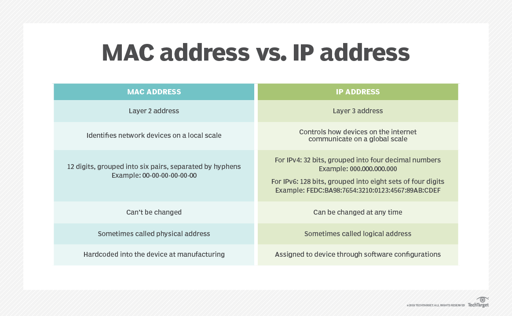

# What's the difference between a MAC address and IP address?

> A MAC address and an IP address each identify network devices, but they do the job at different > levels. Explore the differences between the two and learn why both are necessary.

Every computer or device on the internet has two types of addresses: its physical address and its internet address. The physical address -- which is also called a media access control, or MAC, address -- identifies a device to other devices on the same local network. The internet address -- or IP address -- identifies the device globally. A network packet needs both addresses to get to its destination.

## MAC address vs. IP address: What's the difference?
Both MAC addresses and IP addresses are meant to identify a network device, but in different ways. Some of the main differences between a MAC address and an IP address include the following:

local identification vs. global identification;
Layer 2 vs. Layer 3 operation;
physical address vs. logical address;
number of bits;
address assignment and permanence; and
address formatting.
A MAC address is responsible for local identification and an IP address for global identification. This is the primary difference between a MAC address and IP address, and it affects how they differ in their number of bits, address assignment and interactions. The MAC address is only significant on the LAN to which a device is connected, and it is not used or retained in the data stream once packets leave that network.

Any piece of internet software, such as a web browser, directs data to a destination on the internet using the destination's IP address. That address is inserted into the data packets that the network software stack sends out. People rarely use the address numbers directly, instead using DNS names, which the application translates into the matching number.

Internet routers move the packets from the source network to the destination network and then to the LAN on which the destination device is connected. That local network translates the IP address to a MAC address, adds the MAC address to the data stream and sends the data to the right device.

Another difference between a MAC address and IP address is the way the addresses are assigned. An IP address is bound to a network device via software configurations, and network administrators can change it at any time.

Local network switches maintain Address Resolution Protocol (ARP) tables that map IP addresses to MAC addresses. When a router sends the switch a packet with a destination specified by an IP address, it uses the ARP table to know which MAC address to attach to the packet when it forwards the data to the device as Ethernet frames.

## What is a MAC address?
Media access control refers to the piece of hardware that controls how data is pushed out onto a network. In the OSI reference model for networking, the MAC is a Layer 2 -- or data link layer -- device, and the MAC address is a Layer 2 address. In the current internet era, most devices are connected physically with Ethernet cables or wirelessly with Wi-Fi. Both methods use MAC addresses to identify a device on the network.

A MAC address consists of 12 hexadecimal digits, usually grouped into six pairs separated by hyphens. MAC addresses are available from 00-00-00-00-00-00 through FF-FF-FF-FF-FF-FF. The first half of the number is typically used as a manufacturer ID, while the second half is a device identifier. In nearly all enterprise network devices today, whether Wi-Fi or Ethernet, this number is hardcoded into the device during the manufacturing process.

Each MAC address is unique to the network card installed on a device, but the number of device-identifying bits is limited, which means manufacturers do reuse them. Each manufacturer has about 1.68 million available addresses, so when it burns a device with a MAC address ending in FF-FF-FF, it starts again at 00-00-00. This approach assumes it is highly unlikely two devices with the same address will end up in the same local network segment.

No two devices on a local network should ever have the same MAC address. If that does happen, both devices will have communications problems because the local network will get confused about which device should receive the packet. When a switch broadcasts a packet to all ports in order to find the intended recipient, whichever device responds first will receive the packet stream directed to it. If the device reboots, is taken away or shuts down, the other node may then receive the packets.

## What is an IP address?
IP controls how devices on the internet communicate and defines the behavior of internet routers. It corresponds to Layer 3, the network layer, of the OSI reference model. The internet was initially built around IP version 4 (IPv4) and is in transition to IPv6.

An IP address identifies a device on the global internet, acting as the device's logical address to identify that network connection. An IPv4 address consists of 32 bits, usually written as four decimal numbers, or a dotted quad. Possible values range from 000.000.000.000 through 255.255.255.255, although many possible addresses are disallowed or reserved for specific purposes.

The address combines network identification and device identification data. The network prefix is anywhere from eight to 31 bits, and the remainder identify the device on the network. Steady, rapid growth in the number of internet-connected devices has led to the looming exhaustion of the IPv4 address list, one of several reasons for the development of IPv6.

An IPv6 address consists of 128 bits, with the first 64 reserved for network identification and the second 64 dedicated to identifying a device on the network. The address is written as eight sets of four hexadecimal digits separated by colons -- for example, FEDC:BA98:7654:3210:0123:4567:89AB:CDEF. Happily, many conventions are available to shorten an IPv6 address when writing it. 

